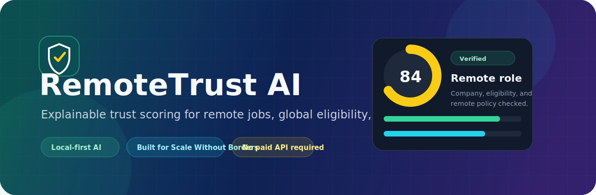
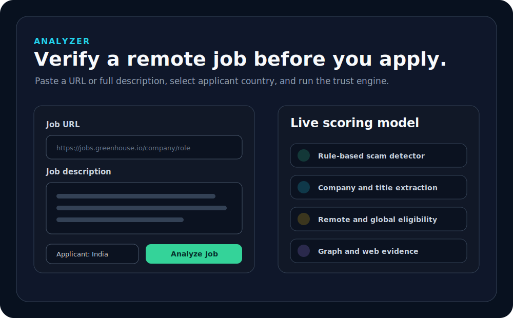
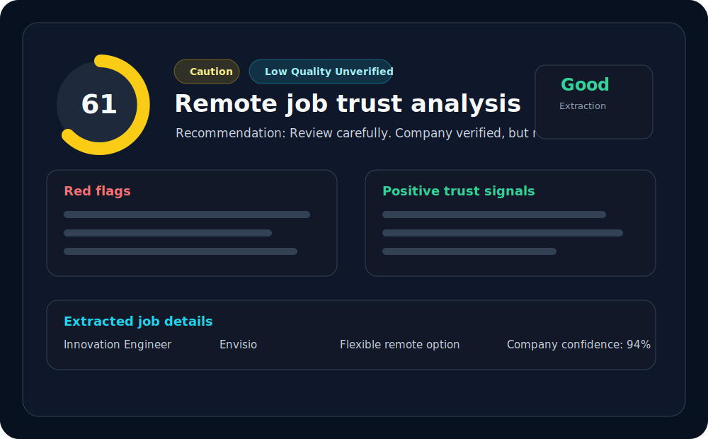
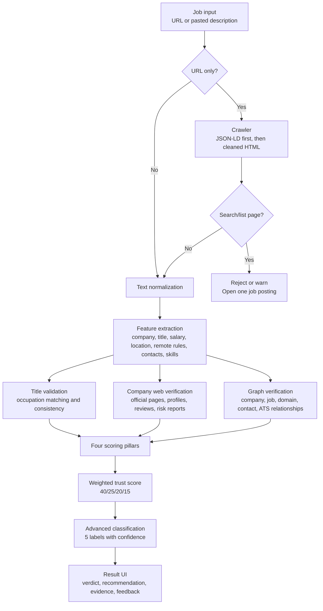
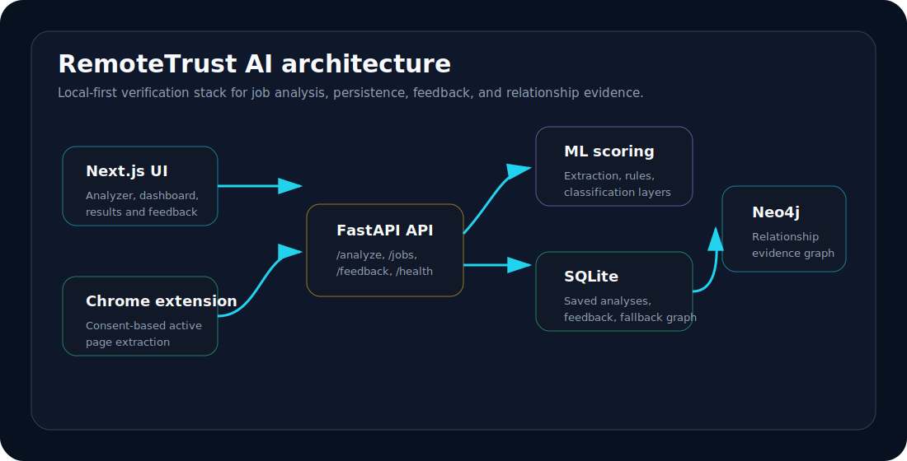
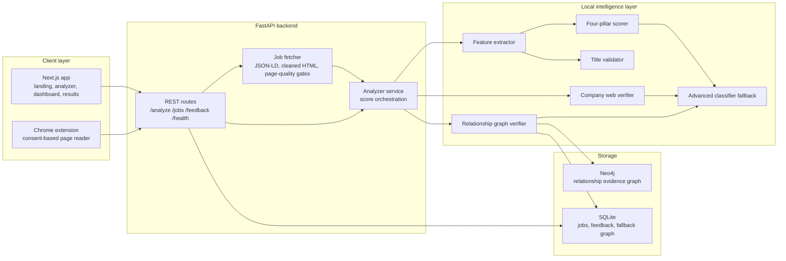

# RemoteTrust AI

<p align="center">
  
</p>

<p align="center">
  <a href="#quick-start"></a>
  <a href="#ai--scoring-pipeline"></a>
  <a href="#api-overview"></a>
  <a href="#tech-stack"></a>
</p>

<p align="center">
  <strong>RemoteTrust AI helps global job seekers verify whether a remote job is real, high-quality, actually remote, and realistically open to applicants from their country.</strong>
</p>

<p align="center">
  Built for the <strong>Scale Without Borders Hackathon</strong>. Local-first, explainable, and demo-ready without paid APIs.
</p>

---

## 60-Second Overview

Remote jobs create opportunity, but they also create confusion. A posting can say "remote" while hiding onsite requirements, country restrictions, fake recruiter contacts, payment requests, vague responsibilities, or low-quality hiring signals.

**RemoteTrust AI** analyzes a job description or public job URL, extracts the key signals, verifies company evidence where possible, scores the posting across four trust pillars, and returns a clear recommendation:

| Output | What judges should notice |
| --- | --- |
| **Trust score** | A 0-100 score weighted by legitimacy, remote authenticity, global eligibility, and job quality. |
| **Verdict** | `Verified`, `Caution`, or `Risky` for fast decision-making. |
| **Recommendation** | `Apply`, `Review carefully`, or `Avoid`. |
| **Explainability** | Red flags, positive signals, extracted job details, title validation, web evidence, graph evidence, and classification reasoning. |
| **Local-first architecture** | Runs with Next.js, FastAPI, SQLite, local ML/rules, and optional Neo4j. |

> The MVP is honest by design: if evidence is weak, the product says so instead of pretending to be certain.

---

## The Problem

Global applicants lose time, trust, and sometimes money because many "remote" postings are not safe or not actually accessible.

| Job seeker pain | Why it matters |
| --- | --- |
| Fake jobs and recruiter scams | Applicants may share personal data, pay fake fees, or contact suspicious chat-only recruiters. |
| Misleading remote claims | "Remote" can still mean hybrid, commute-required, office-based, or restricted to one city/country. |
| Hidden eligibility rules | Work authorization, timezone, and country restrictions often appear deep in the description. |
| Low-quality postings | Vague responsibilities, missing salary, no process, and unclear skills waste applicant time. |

RemoteTrust AI turns this messy text into a structured, explainable trust decision.

---

## The Solution

RemoteTrust AI works like a pre-application trust layer.

1. **Paste a job description or URL.**
2. **Choose applicant country** and optionally a desired role.
3. **Run the analyzer.**
4. **Review the score, verdict, recommendation, warnings, extracted details, and evidence.**
5. **Save feedback** so the prototype has a path toward active learning.

<p align="center">
  
  
</p>

> The SVG previews above are original branded placeholders. Replace them with production screenshots before a final public launch if desired.

---

## What Is Implemented

| Area | Implemented in this repo | Judge value |
| --- | --- | --- |
| Analyzer UI | Next.js `/analyze` page accepts pasted text or URL, applicant country, desired role, and sample jobs. | A fast demo path with realistic input. |
| Results UI | Trust score ring, verdict badge, recommendation, classification, scoring pillars, red flags, positive signals, extraction quality, company evidence, title validation, and feedback buttons. | Explainable AI output that a judge can inspect. |
| Dashboard | `/dashboard` lists saved analyses with search, verdict filter, country filter, score summaries, and result links. | Shows persistence and a working review workflow. |
| Curated opportunities | `/opportunities` shows the lakehouse-published feed with curated, review, and not-recommended buckets plus Job Trust Passport cards and Apply links. | Matches the hackathon output: a practical shortlist of vetted jobs. |
| Real-time ingestion | DuckDB + Parquet Bronze/Silver/Gold layers collect sample files, approved remote-job feeds, and queued URLs on a 5-minute scheduler or manual run. | Shows a credible data pipeline, not just static demo data. |
| API | FastAPI endpoints for analysis, job history, opportunities, ingestion status, manual ingestion runs, URL queueing, individual results, feedback, and health checks. | Clear product boundary and reusable backend. |
| Persistence | SQLite stores analyses, extracted JSON, classification JSON, web evidence, graph evidence, and user feedback. | Demo survives refresh and supports longitudinal trust history. |
| Scoring engine | Local deterministic scorer computes legitimacy, remote authenticity, global eligibility, and job quality. | Works without paid APIs or fragile external model calls. |
| Advanced classification | Five-label classifier: `LEGIT_REMOTE`, `COUNTRY_RESTRICTED_REMOTE`, `HYBRID_OR_LOCATION_BOUND`, `LOW_QUALITY_UNVERIFIED`, `LIKELY_SCAM`. | Converts scores into practical job-seeker language. |
| Title validation | Local occupation-family matching and title-description consistency checks. | Flags fabricated or suspicious role titles. |
| Company web verification | Free public web evidence path for official/career pages, profiles, reviews, and risk language. | Adds external trust signals while gracefully degrading if blocked. |
| Graph verification | Neo4j relationship graph in Docker, with SQLite fallback, connecting companies, jobs, domains, ATS platforms, contacts, sources, and risk signals. | Strong technical differentiator beyond basic keyword scoring. |
| URL crawler | Lightweight crawler prefers `JobPosting` JSON-LD, then cleaned page text and metadata. Rejects noisy search/list pages. | Safer extraction for public career pages and ATS links. |
| Chrome extension | Prototype extension reads supported job pages only after user consent and sends extracted text to the local backend. | Practical path for sites that hide content from backend crawling. |
| Docker Compose | One-command local stack for frontend, backend, and Neo4j. | Judges can run the full prototype quickly. |

### Prototype or Demo-Level Features

| Feature | Current status |
| --- | --- |
| Transformer classifier | Optional future path. The API reports the layer as unavailable when no local artifact is loaded. |
| Structured ML artifact | Optional future path. Deterministic local rules currently provide the reliable MVP baseline. |
| Live web search | Implemented with free public HTML search paths. Search engines can rate-limit or block it, so the API falls back to `Limited evidence`. |
| URL crawling | Best on public ATS/company pages. Protected job boards such as LinkedIn and Indeed may require pasted text or the extension flow. |

---

## Product Demo Flow

Use this for a 3-5 minute hackathon walkthrough.

| Step | What to do | What to say |
| --- | --- | --- |
| 1 | Open `http://localhost:3000`. | "RemoteTrust AI is a trust layer for global job seekers before they apply." |
| 2 | Go to **Analyze**. | "The user can paste a job description or provide a public job URL." |
| 3 | Click **Try Verified Example** and analyze. | "The score rewards official apply links, clear remote language, salary, skills, and global eligibility." |
| 4 | Click **Try Scam Example** and analyze. | "The system catches payment requests, chat-only contact, no-interview urgency, and vague responsibilities." |
| 5 | Click **Try Restricted Remote Example** and analyze. | "A real job can still be bad for a global applicant if it is US-only or authorization-bound." |
| 6 | Open **Curated Opportunities**. | "The expected output is a vetted shortlist, not just one score at a time." |
| 7 | Switch between **Curated**, **Review**, and **Not recommended**. | "The system separates apply-ready roles from restricted jobs, hybrid traps, and scams." |
| 8 | Open **Dashboard**. | "Every analysis is saved, searchable, and filterable by verdict and country." |
| 9 | Open a result and submit feedback. | "Feedback is persisted now and can become an active-learning loop later." |

<details>
<summary><strong>Backup demo plan if a live URL blocks crawling</strong></summary>

Use pasted job descriptions from the sample buttons or `data/sample_jobs.json`. The backend intentionally returns clear crawler errors for protected pages, blocked pages, or search/list pages instead of silently analyzing garbage text.

</details>

---

## AI / Scoring Pipeline

RemoteTrust AI is built around explainable, local-first analysis. It does not need a paid LLM call to produce its core result.



### Scoring Breakdown

| Pillar | Weight | What it checks |
| --- | ---: | --- |
| **Legitimacy** | 40% | Company detection, official apply URL, salary disclosure, responsibilities, hiring process, suspicious contacts, payment language, scam phrases, and risky links. |
| **Remote authenticity** | 25% | Fully remote, remote-first, work-from-anywhere, timezone clarity, hybrid or onsite conflicts, commute requirements, and unclear remote policy. |
| **Global eligibility** | 20% | Applicant country match, worldwide language, country allowlists, authorization requirements, residency/citizenship limits, and contractor-friendly signals. |
| **Job quality** | 15% | Clear responsibilities, required skills, compensation, benefits, experience expectations, interview process, and role specificity. |

Verdicts:

| Score | Verdict | Typical recommendation |
| ---: | --- | --- |
| 80-100 | `Verified` | `Apply` when classification supports a legitimate remote role. |
| 60-79 | `Caution` | `Review carefully`. |
| 0-59 | `Risky` | `Avoid` for scams or severe risk, otherwise `Review carefully` at the caution boundary. |

### Advanced Classification Labels

| Label | Meaning |
| --- | --- |
| `LEGIT_REMOTE` | Strong evidence of a real, remote-friendly, high-quality role. |
| `COUNTRY_RESTRICTED_REMOTE` | Remote role includes country, authorization, timezone, or location limitations. |
| `HYBRID_OR_LOCATION_BOUND` | Remote claim conflicts with onsite, commute, office, or hybrid requirements. |
| `LOW_QUALITY_UNVERIFIED` | Not enough evidence for verified or scam labels, often due to sparse or vague postings. |
| `LIKELY_SCAM` | Scam-like language, payment requests, suspicious contacts, or severe legitimacy risks. |

---

## Example Analysis Output

```text
RemoteTrust AI Result
------------------------------------------------------------
Final score:        84 / 100
Verdict:            Verified
Recommendation:     Apply
Classification:     LEGIT_REMOTE, 80% confidence

Pillars:
  Legitimacy:          90
  Remote Authenticity: 88
  Global Eligibility: 82
  Job Quality:         76

Extracted details:
  Title:        Senior Software Engineer
  Company:      Northstar Labs
  Remote type:  Fully remote
  Countries:    Worldwide
  Salary:       USD 120,000-160,000

Positive signals:
  - Company detected
  - Remote-first policy is explicitly stated
  - Salary or compensation range is disclosed
  - Apply link appears to use a recognized hiring platform

Red flags:
  - No major red flags detected
```

The actual API response also includes title validation, company web verification, graph verification, extraction warnings, evidence snippets, and layer status.

---

## System Architecture

<p align="center">
  
</p>



---

## Tech Stack

| Layer | Actual stack in repo |
| --- | --- |
| Frontend | Next.js 15, React 19, TypeScript, Tailwind CSS, lucide-react, App Router. |
| Backend API | FastAPI, Uvicorn, Pydantic, CORS middleware. |
| Extraction and crawling | httpx, BeautifulSoup, lxml, regex/heuristics, JSON-LD `JobPosting` parsing, tldextract, rapidfuzz. |
| Scoring / ML | Local rule engine, feature extraction, title validator, advanced deterministic classifier, scikit-learn/joblib scripts for baseline TF-IDF + Logistic Regression. |
| Storage | SQLite for saved analyses, feedback, and fallback graph tables. |
| Lakehouse | DuckDB plus Parquet snapshots for Bronze raw events, Silver normalized postings, Gold opportunities, and ingestion run history. |
| Graph | Neo4j Community in Docker, with SQLite fallback when Neo4j is unavailable. |
| Extension | Manifest V3 Chrome extension with consent-based active-page extraction and scoped host permissions. |
| Dev / deployment | Docker Compose, backend Dockerfile, frontend Dockerfile. |

---

## API Overview

| Method | Endpoint | Purpose |
| --- | --- | --- |
| `GET` | `/health` | Service, version, and database health. |
| `POST` | `/analyze` | Analyze a pasted job description or public job URL. |
| `GET` | `/jobs` | List saved analyses for the dashboard. |
| `GET` | `/jobs/{job_id}` | Fetch one saved result. |
| `POST` | `/feedback` | Store applicant feedback on an analysis. |

### Analyze Request

```json
{
  "job_url": "https://jobs.greenhouse.io/example/jobs/123",
  "job_description": "",
  "applicant_country": "India",
  "desired_role": "Software Engineer"
}
```

At least one of `job_url` or `job_description` is required.

### Analyze Response Shape

```json
{
  "job_id": "uuid",
  "final_score": 84,
  "verdict": "Verified",
  "recommended_action": "Apply",
  "scores": {
    "legitimacy": 90,
    "remote_authenticity": 88,
    "global_eligibility": 82,
    "job_quality": 76
  },
  "extracted": {
    "job_title": "Senior Software Engineer",
    "company": "Northstar Labs",
    "company_confidence": 0.95,
    "remote_type": "Fully remote",
    "allowed_countries": ["Worldwide"]
  },
  "classification": {
    "label": "LEGIT_REMOTE",
    "confidence": 0.8,
    "status": "fallback"
  },
  "red_flags": [],
  "positive_signals": ["Company detected: Northstar Labs"],
  "extraction_warnings": []
}
```

<details>
<summary><strong>Additional response objects</strong></summary>

The full response also includes:

- `title_validation`: title verdict, score, closest known titles, evidence, warnings.
- `company_verification`: status, score, queries, sources, signals, warnings.
- `graph_verification`: relationship status, score, nodes, edges, evidence paths.
- `explanation`: human-readable reasoning.

</details>

---

## Quick Start

### Option 1: Docker Compose

```bash
git clone https://github.com/niloy37/remote-trust-ai.git
cd remote-trust-ai
docker compose up --build
```

Then open:

| Service | URL |
| --- | --- |
| Frontend | <http://localhost:3000> |
| Backend API | <http://localhost:8000> |
| API docs | <http://localhost:8000/docs> |
| Neo4j Browser | <http://localhost:7474> |

Neo4j local demo credentials are configured in `docker-compose.yml`.

### Option 2: Manual Development

Backend:

```bash
cd backend
python -m venv .venv
source .venv/bin/activate
pip install -r requirements.txt
uvicorn app.main:app --reload --port 8000
```

Windows PowerShell activation:

```powershell
cd backend
python -m venv .venv
.\.venv\Scripts\Activate.ps1
pip install -r requirements.txt
uvicorn app.main:app --reload --port 8000
```

Frontend:

```bash
cd frontend
npm install
npm run dev
```

Seed demo data:

```bash
cd backend
python seed_db.py --reset
```

Run the lakehouse collector manually:

```bash
curl -X POST http://localhost:8000/ingestion/run
```

---

## Environment Variables

Backend:

| Variable | Default / purpose |
| --- | --- |
| `SQLITE_PATH` | SQLite database path. |
| `CORS_ORIGINS` | Allowed frontend origins. |
| `WEB_VERIFICATION_ENABLED` | Enables or disables free public web verification. |
| `WEB_SEARCH_TIMEOUT_SECONDS` | Search timeout. |
| `WEB_SEARCH_MAX_RESULTS` | Maximum public search results stored. |
| `GRAPH_BACKEND` | `neo4j` by default, can fall back to SQLite. |
| `NEO4J_URI` | Neo4j bolt URL. |
| `NEO4J_USER` / `NEO4J_PASSWORD` | Local graph credentials. |
| `OPENAI_API_KEY` | Optional future extension flag. Core MVP does not require it. |
| `INGESTION_ENABLED` | Starts the near-real-time collector when `true`. |
| `INGESTION_INTERVAL_SECONDS` | Scheduler cadence, default `300`. |
| `LAKEHOUSE_PATH` | DuckDB database and Parquet layer output path. |
| `INGESTION_SOURCE_CONFIG` | Approved file/feed connector config. |

Frontend:

| Variable | Purpose |
| --- | --- |
| `BACKEND_INTERNAL_URL` | Server-side backend URL for production/Docker builds. Defaults to the deployed Render backend when unset. |
| `NEXT_PUBLIC_BACKEND_URL` | Optional browser/frontend deployment backend URL fallback. |
| `NEXT_PUBLIC_API_BASE_PATH` | Browser-facing API proxy path, default `/api/backend`. |

---

## Chrome Extension Prototype

The `chrome-extension/` folder contains a Manifest V3 extension for consent-based job-page extraction.

Current product principles:

- It does **not** auto-read pages.
- The user must open the popup and consent.
- It sends extracted job text to the local backend at `http://127.0.0.1:8000/analyze`.
- Host permissions are intentionally allowlisted instead of broad `https://*/*`.
- The extension is useful when a page is visible in the browser but blocked from backend crawling.

Install locally:

```text
chrome://extensions -> Developer mode -> Load unpacked -> chrome-extension/
```

---

## Tests and Quality Checks

The repo includes backend regression tests, ML tests, and a Chrome extension routing simulation.

Useful checks:

```bash
python -m compileall ml backend/app backend/tests
node --check chrome-extension/content-script.js
node --check chrome-extension/popup.js
node chrome-extension/tests/content-script-routing.test.js
docker compose build
```

If `pytest` is available in your environment:

```bash
python -m pytest backend/tests ml/tests
```

---

## Why This Is Strong for Scale Without Borders

| Rubric area | How RemoteTrust AI earns points |
| --- | --- |
| Problem alignment and impact | Directly addresses fake remote jobs, hidden restrictions, and global applicant uncertainty. Helps job seekers avoid wasted applications and risky postings. |
| Technical execution and functionality | Working full-stack app, API, persistence, local scoring, crawler, web verification, graph verification, dashboard, feedback loop, Docker Compose, and extension prototype. |
| Creativity and innovation | Goes beyond scam detection by combining remote authenticity, global eligibility, job quality, title legitimacy, company web evidence, and relationship graph checks. |
| Pitch and demo quality | Clear analyzer -> result -> dashboard flow, sample jobs for verified/scam/restricted scenarios, and explainable outputs that are easy to narrate. |

---

## Roadmap

### Implemented

- [x] Analyzer with pasted text and URL input.
- [x] Applicant country and desired-role context.
- [x] Four-pillar trust scoring.
- [x] Five-label advanced classification fallback.
- [x] Title validation.
- [x] Company web verification with graceful fallback.
- [x] Neo4j graph verification with SQLite fallback.
- [x] Dashboard and saved result pages.
- [x] User feedback endpoint and UI.
- [x] Docker Compose local run.
- [x] Consent-based Chrome extension prototype.

### Future Work

- [ ] Replace placeholder screenshots with final captured product screenshots.
- [ ] Train and ship a larger local classifier artifact when enough labeled data exists.
- [ ] Add multilingual job description support.
- [ ] Build a country-specific eligibility rules engine.
- [ ] Expand graph reputation patterns across recruiter contacts, domains, and repeated scam signals.
- [ ] Add organization or university career-center workspaces.
- [ ] Add browser-extension support for more sites while keeping permissions scoped and user-controlled.
- [ ] Improve hosted deployment packaging for public demo environments.

---

## Repository Map

```text
remote-trust-ai/
  frontend/          Next.js app, routes, UI components, API client
  backend/           FastAPI app, routes, services, SQLite persistence
  ml/                Feature extraction, scoring, title validation, classifiers, training scripts
  chrome-extension/  Consent-based local extension prototype
  data/              Demo sample jobs and advanced sample data
  docs/              Pitch, pipeline, demo script, README visual assets
  specs/             Advanced ML and graph planning docs
```

---

## Hackathon Acknowledgement

RemoteTrust AI was built for the **Scale Without Borders Hackathon** as a practical, explainable AI prototype for global job seekers.

The core idea is simple: remote opportunity should be global, but trust should not be guesswork.
